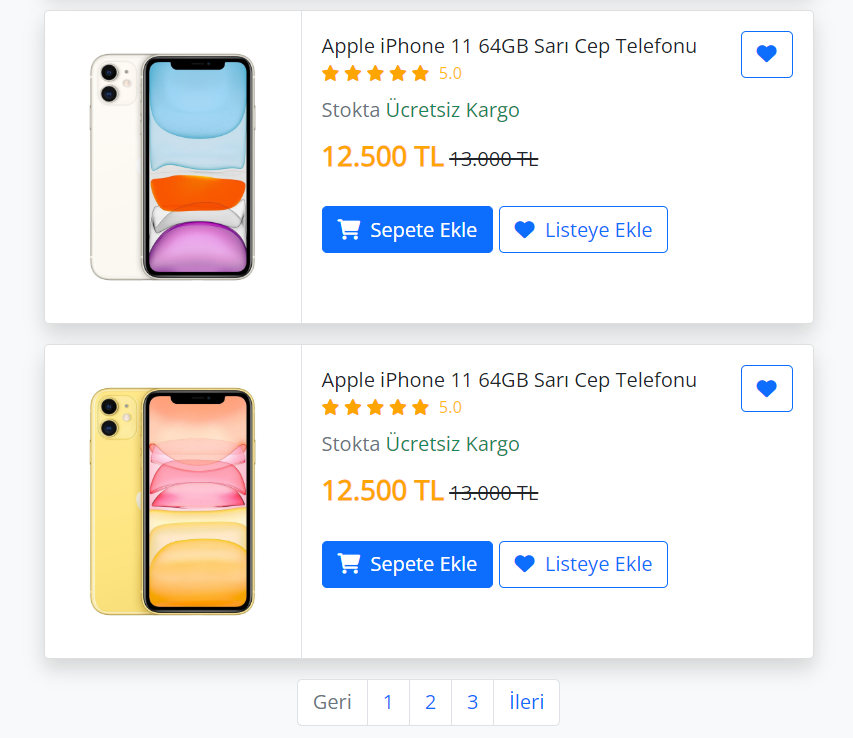

# Product Card Showcase 📱

## Overview
The Product Card Showcase project displays product cards with detailed information, ratings, and pricing. The responsive design ensures an optimal viewing experience on various devices.

## Technologies Used 🚀
- **HTML**
- **CSS (Bootstrap 5)**
- **Font Awesome Icons**

## Features ✨
- Engaging product cards with images, descriptions, and pricing.
- Dynamic "Add to Cart" and "Add to Wishlist" functionality.
- Ratings and stock status for each product.
- Pagination for easy navigation through multiple products.

## Usage 💻
1. Explore different products with detailed information.
2. Click the "Add to Cart" button to include a product in your shopping cart.
3. Use the "Add to Wishlist" button to create a list of desired items.
4. Navigate through product pages using the pagination links.

## Live Demo 🌐
Live Demo: [Product Card Showcase Demo](https://product-cards-six.vercel.app/)

## Installation
No special installation is required for this project. Simply open the `index.html` file in a web browser.

## Contributing 🤝
Feel free to use, modify, and contribute to the project! If you have any questions or feedback, you can reach me at your nisagokdemir@gmail.com

## License
This project is licensed under the **MIT License**.

